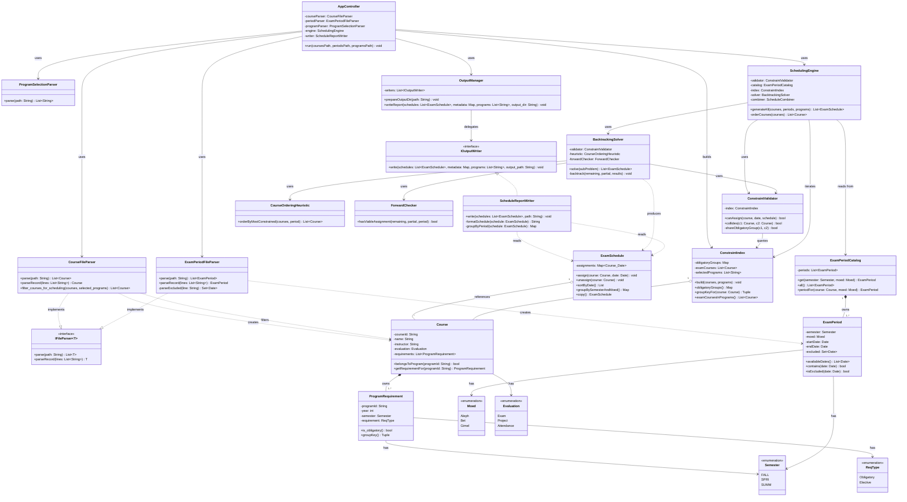

```mermaid
classDiagram
    direction TB

    %% ===== Application Layer =====
    class AppController {
        -courseParser: CourseFileParser
        -periodParser: ExamPeriodFileParser
        -programParser: ProgramSelectionParser
        -engine: SchedulingEngine
        -writer: ScheduleReportWriter
        +run(coursesPath, periodsPath, programsPath) void
    }

    %% ===== Infrastructure Layer =====
    class IFileParser~T~ {
        <<interface>>
        +parse(path: String) List~T~
        +parseRecord(lines: List~String~) T
    }

    

    class CourseFileParser {
        +parse(path: String) List~Course~
        +parseRecord(lines: List~String~) Course
        +filter_courses_for_scheduling(courses, selected_programs) List~Course~
    }

    class ExamPeriodFileParser {
        +parse(path: String) List~ExamPeriod~
        +parseRecord(lines: List~String~) ExamPeriod
        -parseExcluded(line: String) Set~Date~
    }

    class ProgramSelectionParser {
        +parse(path: String) List~String~
    }

    class ScheduleReportWriter {
        +write(schedules: List~ExamSchedule~, path: String) void
        -formatSchedule(schedule: ExamSchedule) String
        -groupByPeriod(schedule: ExamSchedule) Map
    }

    %% ===== Output Layer =====
    class IOutputWriter {
        <<interface>>
        +write(schedules: List~ExamSchedule~, metadata: Map, programs: List~String~, output_path: String) void
    }

    class OutputManager {
        -writers: List~IOutputWriter~
        +prepareOutputDir(path: String) void
        +writeReport(schedules: List~ExamSchedule~, metadata: Map, programs: List~String~, output_dir: String) void
    }

    %% ===== Domain Layer =====
    class Course {
        -courseId: String
        -name: String
        -instructor: String
        -evaluation: Evaluation
        -requirements: List~ProgramRequirement~
        +belongsToProgram(programId: String) bool
        +getRequirementFor(programId: String) ProgramRequirement
    }

    class ProgramRequirement {
        -programId: String
        -year: int
        -semester: Semester
        -requirement: ReqType
        +is_obligatory() bool
        +groupKey() Tuple
    }

    class ExamPeriod {
        -semester: Semester
        -moed: Moed
        -startDate: Date
        -endDate: Date
        -excluded: Set~Date~
        +availableDates() List~Date~
        +contains(date: Date) bool
        +isExcluded(date: Date) bool
    }

    class ExamPeriodCatalog {
        -periods: List~ExamPeriod~
        +get(semester: Semester, moed: Moed) ExamPeriod
        +all() List~ExamPeriod~
        +periodFor(course: Course, moed: Moed) ExamPeriod
    }

    class ConstraintIndex {
        -obligatoryGroups: Map
        -examCourses: List~Course~
        -selectedPrograms: List~String~
        +build(courses, programs) void
        +obligatoryGroups() Map
        +groupKeyFor(course: Course) Tuple
        +examCoursesInPrograms() List~Course~
    }

    class ExamSchedule {
        -assignments: Map~Course_Date~
        +assign(course: Course, date: Date) void
        +unassign(course: Course) void
        +sortByDate() List
        +groupBySemesterAndMoed() Map
        +copy() ExamSchedule
    }

    %% ===== Logic Layer =====
    class ConstraintValidator {
        -index: ConstraintIndex
        +canAssign(course, date, schedule) bool
        +collides(c1: Course, c2: Course) bool
        -shareObligatoryGroup(c1, c2) bool
    }

    class SchedulingEngine {
        -validator: ConstraintValidator
        -catalog: ExamPeriodCatalog
        -index: ConstraintIndex
        -solver: BacktrackingSolver
        -combiner: ScheduleCombiner
        +generateAll(courses, periods, programs) List~ExamSchedule~
        -orderCourses(courses) List~Course~
    }

    class BacktrackingSolver {
        -validator: ConstraintValidator
        -heuristic: CourseOrderingHeuristic
        -forwardChecker: ForwardChecker
        +solve(subProblem) List~ExamSchedule~
        -backtrack(remaining, partial, results) void
    }

    class CourseOrderingHeuristic {
        +orderByMostConstrained(courses, period) List~Course~
    }

    class ForwardChecker {
        +hasViableAssignment(remaining, partial, period) bool
    }

    %% ===== Enumerations =====
    class Semester {
        <<enumeration>>
        FALL
        SPRI
        SUMM
    }

    class Moed {
        <<enumeration>>
        Aleph
        Bet
        Gimel
    }

    class ReqType {
        <<enumeration>>
        Obligatory
        Elective
    }

    class Evaluation {
        <<enumeration>>
        Exam
        Project
        Attendance
    }

    %% ===== Relationships =====

    %% Application controls everything
    AppController --> CourseFileParser : uses
    AppController --> ExamPeriodFileParser : uses
    AppController --> ProgramSelectionParser : uses
    AppController --> SchedulingEngine : uses
    AppController --> OutputManager : uses
    AppController --> ConstraintIndex : builds

    %% Parsers implement interface
    CourseFileParser ..|> IFileParser : implements
    ExamPeriodFileParser ..|> IFileParser : implements

    %% Parsers create domain objects
    CourseFileParser ..> Course : creates
    CourseFileParser ..> Course : filters
    ExamPeriodFileParser ..> ExamPeriod : creates

    %% Output wiring
    OutputManager --> IOutputWriter : delegates
    IOutputWriter <|.. ScheduleReportWriter
    ScheduleReportWriter ..> ExamSchedule : reads

    %% Domain composition
    Course "1" *-- "1..*" ProgramRequirement : owns
    ExamPeriodCatalog "1" *-- "1..*" ExamPeriod : owns
    ExamSchedule "1" o-- "*" Course : references

    %% Constraint index aggregates courses
    ConstraintIndex "1" o-- "*" Course : indexes

    %% Logic layer wiring
    ConstraintValidator --> ConstraintIndex : queries
    SchedulingEngine --> ConstraintValidator : uses
    SchedulingEngine --> ExamPeriodCatalog : reads from
    SchedulingEngine --> ConstraintIndex : iterates
    SchedulingEngine --> BacktrackingSolver : uses
    BacktrackingSolver --> CourseOrderingHeuristic : uses
    BacktrackingSolver --> ForwardChecker : uses
    BacktrackingSolver --> ConstraintValidator : uses
    BacktrackingSolver ..> ExamSchedule : produces

    %% Writer consumes results
    ScheduleReportWriter ..> ExamSchedule : reads

    %% Enum usage
    ProgramRequirement --> Semester : has
    ProgramRequirement --> ReqType : has
    ExamPeriod --> Semester : has
    ExamPeriod --> Moed : has
    Course --> Evaluation : has
```