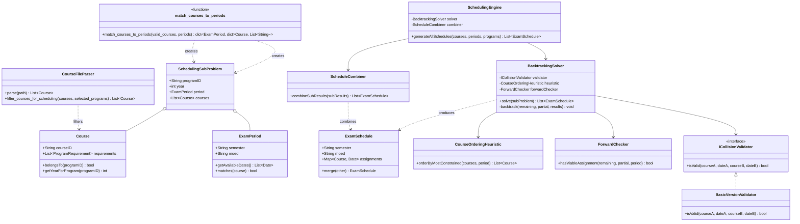

```mermaid
classDiagram

    %% ===== Domain Models (Used by the algorithm) =====
    class Course {
        +String courseID
        +List~ProgramRequirement~ requirements
        +belongsTo(programID) bool
        +getYearForProgram(programID) int
    }

    class ExamPeriod {
        +String semester
        +String moed
        +getAvailableDates() List~Date~
        +matches(course) bool
    }

    class ExamSchedule {
        +String semester
        +String moed
        +Map~Course, Date~ assignments
        +merge(other) ExamSchedule
    }

    %% ===== Engine Orchestrator =====
    class SchedulingEngine {
        -BacktrackingSolver solver
        -ScheduleCombiner combiner
        +generateAllSchedules(courses, periods, programs) List~ExamSchedule~
    }

    %% ===== Problem Decomposition =====
    %% Partitioning is implemented by a function in code
    class match_courses_to_periods {
        <<function>>
        +match_courses_to_periods(valid_courses, periods) dict~ExamPeriod, dict~Course, List~String~~
    }

    class SchedulingSubProblem {
        +String programID
        +int year
        +ExamPeriod period
        +List~Course~ courses
    }

    %% ===== Backtracking Core =====
    class BacktrackingSolver {
        -ICollisionValidator validator
        -CourseOrderingHeuristic heuristic
        -ForwardChecker forwardChecker
        +solve(subProblem) List~ExamSchedule~
        -backtrack(remaining, partial, results) void
    }

    class CourseOrderingHeuristic {
        +orderByMostConstrained(courses, period) List~Course~
    }

    class ForwardChecker {
        +hasViableAssignment(remaining, partial, period) bool
    }

    class ICollisionValidator {
        <<interface>>
        +isValid(courseA, dateA, courseB, dateB) bool
    }

    class BasicVersionValidator {
        +isValid(courseA, dateA, courseB, dateB) bool
    }

    %% ===== Combination =====
    class ScheduleCombiner {
        +combineSubResults(subResults) List~ExamSchedule~
    }

    %% ===== Relationships =====
    SchedulingEngine --> BacktrackingSolver
    SchedulingEngine --> ScheduleCombiner

    match_courses_to_periods ..> SchedulingSubProblem : creates
    SchedulingSubProblem o-- Course
    SchedulingSubProblem o-- ExamPeriod

    BacktrackingSolver --> ICollisionValidator
    BacktrackingSolver --> CourseOrderingHeuristic
    BacktrackingSolver --> ForwardChecker
    BacktrackingSolver ..> ExamSchedule : produces

    ICollisionValidator <|.. BasicVersionValidator

    ScheduleCombiner ..> ExamSchedule : combines

    %% Added components: filtering and partitioning (implemented in code)
    class CourseFileParser {
        +parse(path) List~Course~
        +filter_courses_for_scheduling(courses, selected_programs) List~Course~
    }

    %% The application controller calls the partition function and passes
    %% the resulting scheduling tasks into SchedulingEngine.generateAll()
    match_courses_to_periods ..> SchedulingSubProblem : creates
    CourseFileParser ..> Course : filters
```