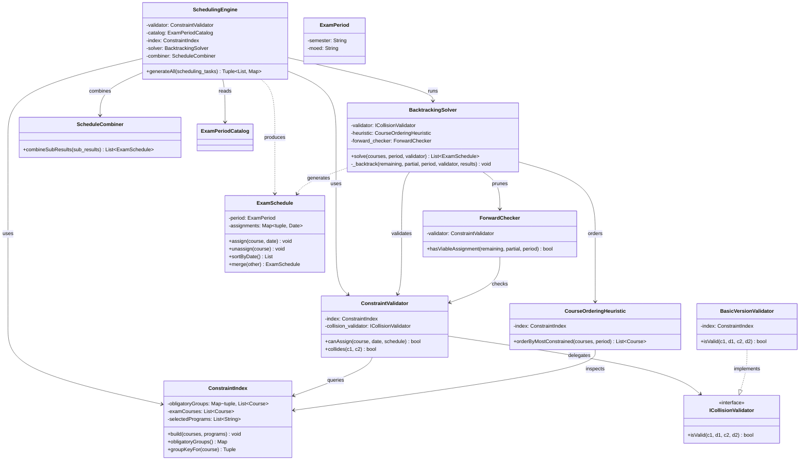

# Algorithm Subsystem Diagram

Detailed view of the scheduling algorithm layer: backtracking solver, constraint validation, heuristics, and schedule combination.

## Overview
- **SchedulingEngine**: Orchestrates scheduling per period
- **ConstraintIndex**: Builds conflict groups for fast lookup
- **ConstraintValidator**: Validates candidate assignments
- **BasicVersionValidator**: Checks assignment conflicts
- **BacktrackingSolver**: Enumerates valid schedules for one period
- **CourseOrderingHeuristic**: Orders courses by constraint level
- **ForwardChecker**: Prunes impossible branches early
- **ScheduleCombiner**: Combines per-period results
