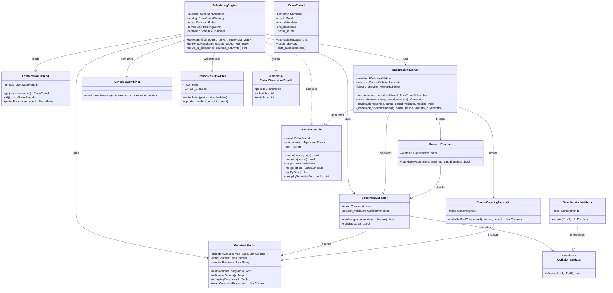

# Algorithm Subsystem Diagram

Detailed view of the scheduling algorithm layer: backtracking solver, constraint validation, heuristics, schedule combination, and disk-based result storage.

## Overview
- **SchedulingEngine**: Main orchestrator. Three entry points: `generateAll()` (blocking, in-memory), `iterPeriodResults()` (streaming generator, in-memory), `solve_to_disk()` (streaming, writes directly to disk for the multi-process architecture).
- **ConstraintIndex**: Pre-computes obligatory-group conflict sets and lists exam-evaluation courses for fast lookup during backtracking.
- **ConstraintValidator**: Validates whether assigning a course to a date is legal given the current partial schedule.
- **BasicVersionValidator**: Implements `ICollisionValidator`; checks that two courses with shared obligatory-program students are not scheduled on the same day.
- **BacktrackingSolver**: Enumerates all valid schedules for one period via recursive backtracking. `solve_stream()` yields solutions one at a time (used by `solve_to_disk`).
- **CourseOrderingHeuristic**: Orders courses by "most constrained first" to reduce the search tree.
- **ForwardChecker**: Prunes branches where a remaining course has no viable date left.
- **ScheduleCombiner**: Takes per-period result lists and computes the Cartesian product to produce combined cross-period schedules.
- **PeriodResultsWriter**: Writes solved `ExamSchedule` objects to batched pickle files (`BATCH_SIZE=50`) and maintains a `manifest.json` index. Used by `SchedulingEngine.solve_to_disk()` in the multi-process architecture.
