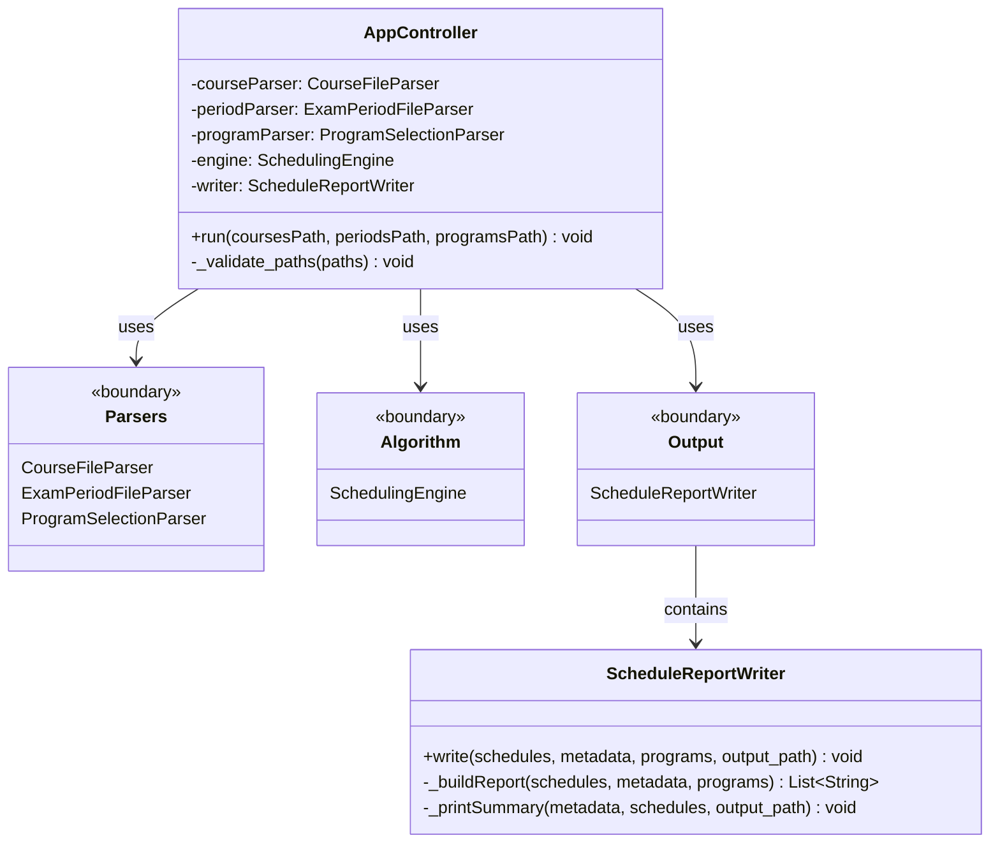

# AppController & Interaction Diagram

Shows the main application entry point and how it orchestrates the three subsystems (Parsers, Algorithm, Report Writer).

## Overview
- **AppController**: Main orchestrator that coordinates parsing, scheduling, and reporting
- **Parsers**: Boundary to the parser subsystem (see `CD_02_Parsers`)
- **Algorithm**: Boundary to the algorithm subsystem (see `CD_03_Algorithm`)
- **Output**: Boundary to the report writer/output handling
