# Input Screen Class Diagram

Detailed structure of `InputScreen` and all its contained widgets, view-model dataclasses, formatters, and state objects.

```mermaid
classDiagram
    direction TB

    class InputScreen {
        -service: IAppService
        +file_loader: FileLoaderWidget
        +program_list: ProgramListWidget
        +period_list: PeriodListWidget
        +period_editor: PeriodEditorWidget
        +selected_panel: SelectedProgramsPanel
        +generate_btn: QPushButton
        +spinner: LoadingSpinner
        +error_banner: ErrorBanner
        -_generate_state: GenerateButtonState
        -_worker: EngineListener
        +switch_to_output: pyqtSignal
        +_on_files_loaded()
        +_on_programs_selected(selected_programs)
        +_on_period_selected(period_id)
        +_on_generate_clicked()
        +_on_generation_finished(count)
        +_on_period_ready(period_id)
        +_on_error(message)
        -_make_section(number, title, widgets, subtitle) QFrame
        -_sync_generate_button_state()
    }
    note for InputScreen "3-column layout: col1=Data Input, col2=Study Programs,\ncol3=Exam Period. Bottom bar has fixed-height generate bar.\nWidgets start hidden; shown progressively as user advances.\nprogram_removed signal wired: selected_panel → program_list.remove_selection"

    %% ===== File Loading =====
    class FileLoaderWidget {
        -_service: IAppService
        -_validator: FilePathValidator
        -_courses_paths: list[str]
        -_dates_path: str
        +files_loaded: pyqtSignal
        +update_validation(programs, period)
        -_load_files()
        -_get_mode() str
        -_set_loading_state(is_loading)
    }

    class DropZoneCard {
        -_paths: list[str]
        -_replace_mode: bool
        -_single_file: bool
        +file_added: pyqtSignal(str)
    }

    class FilePathValidator {
        +validate(courses_paths, dates_path)
    }

    %% ===== Program Selection =====
    class ProgramListWidget {
        -_service: IAppService
        -_max_selection: int
        -_selected_ids: set[str]
        -_rows_by_id: dict[str, ProgramRowWidget]
        -_search_input: QLineEdit
        +programs_selected: pyqtSignal(list)
        +refresh()
        +selected_programs() list[str]
        +clear_selection()
        +remove_selection(program_id)
        -_on_program_clicked(program_id)
        -_update_row_states()
        -_apply_search_filter(text)
    }

    class ProgramRowWidget {
        <<QWidget>>
        -program: ProgramItem
        -_selected: bool
        -_badge: QLabel
        -_name_lbl: QLabel
        +clicked: pyqtSignal
        +text() str
        +click()
        +set_selected(selected)
        +setDisabled(disabled)
    }
    note for ProgramRowWidget "Badge shows 2-letter abbreviation.\nColor determined by badge_color_for(program_id).\nExposes text()/click() for test compatibility."

    class ProgramItem {
        <<dataclass>>
        +program_id: str
        +name: str
    }

    %% ===== Period Selection =====
    class PeriodListWidget {
        -_service: IAppService
        -_formatter: PeriodFormatter
        -_selected_period_id: str
        -_rows_by_id: dict[str, PeriodRowWidget]
        +period_selected: pyqtSignal(str)
        +refresh()
        +selected_period_id() str
        +clear_selection()
        -_on_period_clicked(period_id)
        -_update_row_states()
    }

    class PeriodRowWidget {
        -period: PeriodItem
        -_selected: bool
        +set_selected(selected)
    }

    class PeriodItem {
        <<dataclass>>
        +period_id: str
        +title: str
        +start_date: date
        +end_date: date
    }

    class PeriodFormatter {
        +format(period_dict) PeriodItem
        -_format_date(value) str
    }

    %% ===== Period Editor =====
    class PeriodEditorWidget {
        -_service: IAppService
        -_formatter: EditablePeriodFormatter
        -_current_period_id: str
        +load_period(period_id)
        +clear()
        +current_period_id() str
        -_on_day_clicked(qdate)
        -_on_save_requested(start, end, unavailable_days)
    }

    class EditablePeriod {
        <<dataclass>>
        +period_id: str
        +title: str
        +start_date: date
        +end_date: date
        +forbidden_days: set
    }

    class EditablePeriodFormatter {
        +format(period_dict) EditablePeriod
        -_format_date(value) str
    }

    class CalendarTableWidget {
        -mode: CalendarMode
        +day_clicked: pyqtSignal
        +save_requested: pyqtSignal
        +update_schedule(schedule_data, unavailable_dates)
        +set_date_range(start, end)
        +set_unavailable_days(days)
        +get_unavailable_days() list
    }

    %% ===== Selected Programs Panel =====
    class SelectedProgramsPanel {
        -_service: IAppService
        -_formatter: CourseFormatter
        +program_removed: pyqtSignal(str)
        +refresh(program_ids)
        +clear()
        +clear_cache()
        +cached_program_ids() list[str]
    }
    note for SelectedProgramsPanel "Chip-style expandable cards.\nprogram_removed → ProgramListWidget.remove_selection"

    class ProgramChip {
        <<QFrame>>
        -program_id: str
        -_courses: list[CourseItem]
        -_expanded: bool
        +remove_clicked: pyqtSignal(str)
        -_toggle_expand()
    }
    note for ProgramChip "Header: badge + program ID + name + chevron + × remove btn.\nBody: collapsible course table grouped by year/semester."

    class CourseItem {
        <<dataclass>>
        +number: str
        +name: str
        +year: int
        +semester: str
        +course_type: str
        +evaluation: str
    }

    class CourseFormatter {
        +format(course_dict) CourseItem
    }

    %% ===== State & Shared Components =====
    class GenerateButtonState {
        +has_selected_programs: bool
        +has_viewed_period: bool
        +is_generating: bool
        +reset_after_file_load()
        +set_program_selection(has_selection)
        +set_period_viewed(has_period)
        +start_generation()
        +finish_generation()
        +should_show_button() bool
        +should_enable_button() bool
    }

    class ErrorBanner {
        +dismissed: pyqtSignal
        +show_error(message)
        +hide_error()
    }

    class LoadingSpinner {
        +start()
        +stop()
    }

    %% ===== Relationships =====
    InputScreen --> FileLoaderWidget : col 1
    InputScreen --> ProgramListWidget : col 2 top
    InputScreen --> SelectedProgramsPanel : col 2 bottom
    InputScreen --> PeriodListWidget : col 3 top
    InputScreen --> PeriodEditorWidget : col 3 bottom
    InputScreen --> ErrorBanner : bottom bar
    InputScreen --> LoadingSpinner : bottom bar
    InputScreen --> GenerateButtonState : owns

    FileLoaderWidget --> DropZoneCard : contains (courses + dates)
    FileLoaderWidget --> FilePathValidator : uses

    ProgramListWidget --> ProgramRowWidget : creates per program
    ProgramRowWidget --> ProgramItem : displays
    SelectedProgramsPanel ..> ProgramListWidget : program_removed → remove_selection

    PeriodListWidget --> PeriodRowWidget : creates per period
    PeriodListWidget --> PeriodFormatter : uses
    PeriodFormatter --> PeriodItem : creates
    PeriodRowWidget --> PeriodItem : displays

    PeriodEditorWidget --> EditablePeriodFormatter : uses
    PeriodEditorWidget --> CalendarTableWidget : contains
    EditablePeriodFormatter --> EditablePeriod : creates

    SelectedProgramsPanel --> CourseFormatter : uses
    SelectedProgramsPanel --> ProgramChip : creates per program
    CourseFormatter --> CourseItem : creates
    ProgramChip --> CourseItem : displays
```

## Overview

### Layout
`InputScreen` uses a **3-column layout** with a fixed-height bottom generate bar:
- **Col 1 — Data Input**: `FileLoaderWidget` (file drop zones for courses + dates)
- **Col 2 — Study Programs**: `ProgramListWidget` (top, stretch 2) + `SelectedProgramsPanel` (bottom, stretch 1)
- **Col 3 — Exam Period**: `PeriodListWidget` (capped at 220 px) + `PeriodEditorWidget` (below, stretch 1)
- **Bottom bar** (68 px fixed): `LoadingSpinner` + `GenerateButton` centered; `ErrorBanner` sits above the bar

`_make_section(number, title, widgets, subtitle)` wraps each column in a numbered card with a drop-shadow `QFrame`.

Widgets use **progressive disclosure** — program list, period list, period editor, and selected panel all start hidden and become visible only when the preceding step is complete.

### Components
- **FileLoaderWidget**: Two `DropZoneCard` widgets (courses + dates) plus a `FilePathValidator`. Exposes `update_validation(programs, period)` so `InputScreen` can drive a validation indicator in the file loader after program/period state changes.
- **ProgramListWidget**: Scrollable list with a search `QLineEdit` at the top. Max 5 selected. Each row is a `ProgramRowWidget` (a `QWidget` with a colored 2-letter badge). Exposes `remove_selection(program_id)` — called by `SelectedProgramsPanel` via the `program_removed` signal cross-connection.
- **ProgramRowWidget**: `QWidget` (not `QPushButton`) with a colored badge (`abbreviate_name()` + `badge_color_for()`). Exposes `text()` and `click()` for test compatibility.
- **SelectedProgramsPanel**: Chip-style expandable cards (`ProgramChip`) — one per selected program. Each chip shows a badge, program name, a chevron to expand course details, and a × button. The × emits `program_removed(program_id)`, which is wired to `ProgramListWidget.remove_selection()`.
- **PeriodListWidget**: Scrollable list of exam periods. Emits `period_selected` so `InputScreen` can load the editor.
- **PeriodEditorWidget**: Embeds a `CalendarTableWidget` (INPUT mode) to toggle forbidden days and shift period dates.
- **GenerateButtonState**: Pure-data state machine. Controls when the Generate button is shown and enabled — requires at least one program selected and one period viewed.
- **ErrorBanner / LoadingSpinner**: Shared feedback components in the bottom bar.
