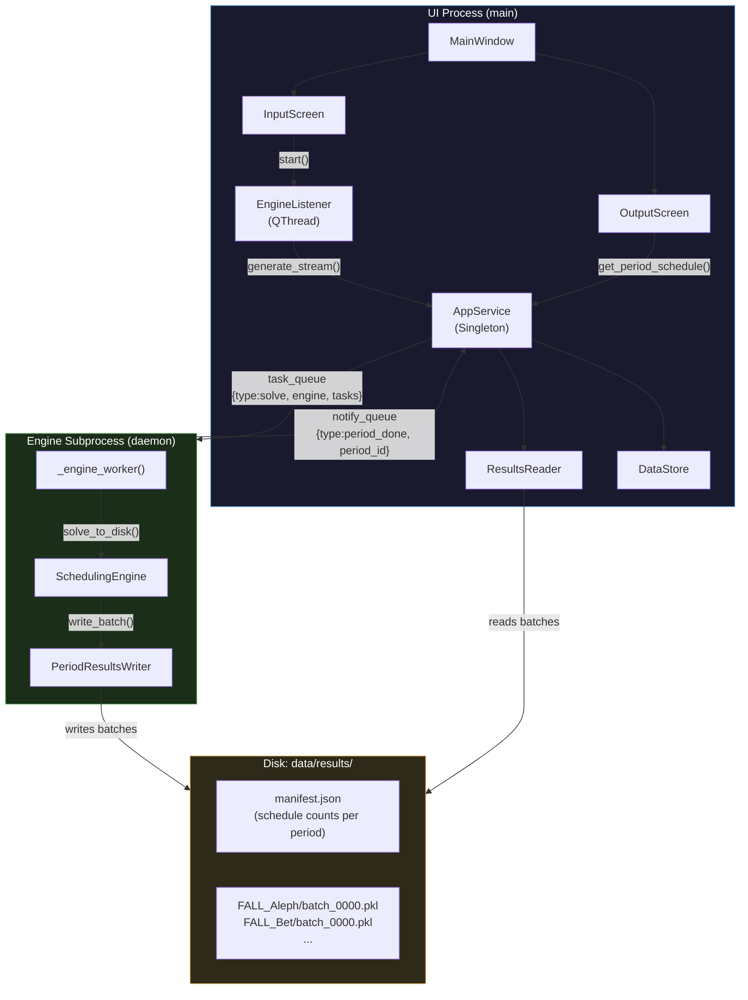

# Multi-Process Architecture Diagram

Shows the two-process architecture (EP-83): how the UI process and the Engine subprocess communicate through multiprocessing queues and a shared disk directory. This is a **component/deployment view** — not a class diagram.



## Overview

### Why two processes?
Python has a Global Interpreter Lock (GIL) which prevents true parallelism with threads. Moving the algorithm into a separate OS process gives it its own Python interpreter and its own GIL, so the UI event loop is **never blocked** by solver computation — even for periods with thousands of results.

### Communication protocol
Only **lightweight** messages cross the process boundary:

| Direction | Channel | Message |
|-----------|---------|---------|
| UI → Engine | `task_queue` | `{type: "solve", engine, tasks}` |
| Engine → UI | `notify_queue` | `{type: "period_done", period_id: str}` |
| Engine → UI | `notify_queue` | `{type: "all_done"}` |
| Engine → UI | `notify_queue` | `{type: "error", message: str}` |

`ExamSchedule` objects are **never sent through the queues** — they are written to disk by the subprocess and read back independently by `ResultsReader`.

### Threading model within the UI process
| Component | Thread |
|-----------|--------|
| `MainWindow`, `InputScreen`, `OutputScreen`, all widgets | Qt main thread (event loop) |
| `EngineListener.run()` | Background `QThread` |

`EngineListener` blocks on `notify_queue.get()` (via `AppService.generate_stream()`). Since it never runs CPU-heavy Python work, blocking on a queue is acceptable — it frees the main thread completely.

### Disk storage layout
```
data/results/
├── manifest.json          ← { "FALL_Aleph": 120, "FALL_Bet": 85, … }
├── FALL_Aleph/
│   ├── batch_0000.pkl     ← schedules[0..49]
│   ├── batch_0001.pkl     ← schedules[50..99]
│   └── …
└── FALL_Bet/
    └── batch_0000.pkl
```
`BATCH_SIZE = 50`. `ResultsReader` loads only the one batch file that contains the requested index.
