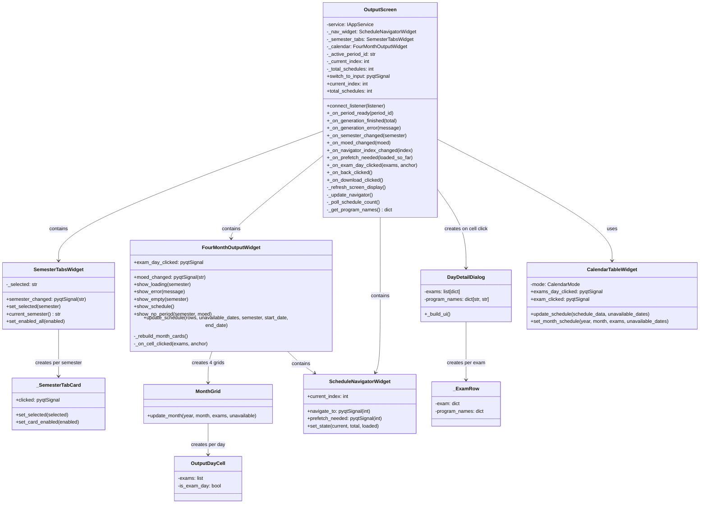

# Output Screen Class Diagram

Detailed structure of `OutputScreen` and all its display components: semester tabs, four-month calendar widget, schedule navigator, and day-detail popup.

## Overview
- **OutputScreen**: Root output view. Connects to `EngineListener` signals via `connect_listener()` so it receives `period_ready` and `finished` events. Polls `get_schedule_count()` periodically while generation is in progress.
- **SemesterTabsWidget**: Horizontal tab row (FALL / SPRING / SUMMER). Emits `semester_changed` when the user switches tabs, triggering a calendar refresh.
- **FourMonthOutputWidget**: The main calendar display. Shows 4 `MonthGrid` cards side by side, one per calendar month. Supports loading/error/empty/no-period state pages. Emits `exam_day_clicked` when a cell with exams is clicked. Also contains the moed selector buttons (Aleph/Bet/Gimel).
- **MonthGrid**: Renders one calendar month as a grid of `OutputDayCell` objects.
- **OutputDayCell**: A single calendar cell that highlights exam days and fires a click signal when the user selects it.
- **ScheduleNavigatorWidget**: Prev/Next buttons with a counter ("3 / 120"). Emits `navigate_to(index)` and `prefetch_needed(loaded_so_far)` for lazy loading.
- **DayDetailDialog**: Popup that appears when the user clicks a day with exams. Lists each exam with its course name, type badge, programs, and date.
- **CalendarTableWidget**: Shared INPUT/OUTPUT calendar widget (also used by `PeriodEditorWidget` in INPUT mode for editing forbidden days).
