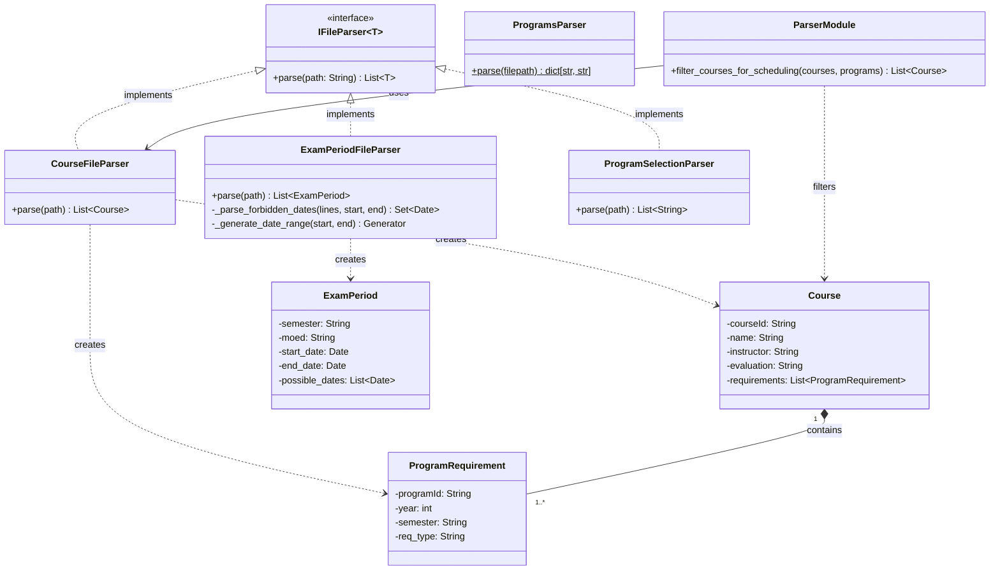

# Parser Subsystem Diagram

Detailed view of the parser layer responsible for reading input files and creating domain objects.

## Overview
- **IFileParser**: Generic interface for file-based parsers.
- **CourseFileParser**: Parses courses and program requirements from the courses data file.
- **ExamPeriodFileParser**: Parses exam periods and forbidden dates from the dates data file.
- **ProgramSelectionParser**: Parses a list of selected program IDs from a text file (used by the CLI `AppController`).
- **ProgramsParser**: Static parser that reads `data/programsName.txt` and returns a `{program_id: display_name}` mapping. Used by `AppService` to show human-readable program names in the UI.
- **ParserModule** (`filter_courses_for_scheduling`): Module-level function that filters the full course list down to only those belonging to selected programs and having an exam evaluation type.
