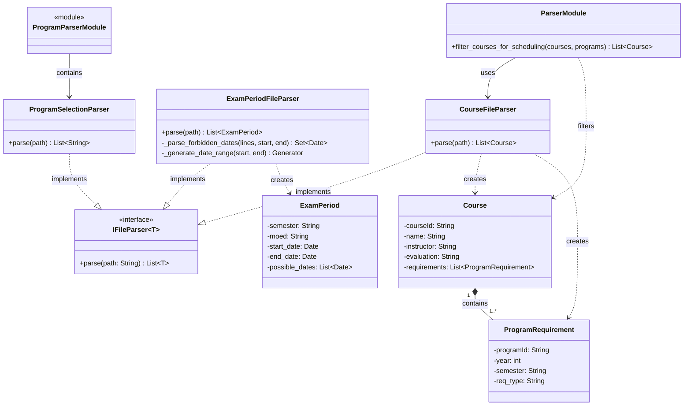

# Parser Subsystem Diagram

Detailed view of the parser layer responsible for reading input files and creating domain objects.

## Overview
- **IFileParser**: Generic interface for all file parsers
- **CourseFileParser**: Parses courses and program requirements
- **ExamPeriodFileParser**: Parses exam periods and forbidden dates
- **ProgramSelectionParser**: Parses selected program IDs
- **ProgramParserModule**: Represents `src/parsers/program_parser.py`, which contains `ProgramSelectionParser`
- **ParserModule**: Module-level function `filter_courses_for_scheduling` that filters courses by evaluation type and program membership
