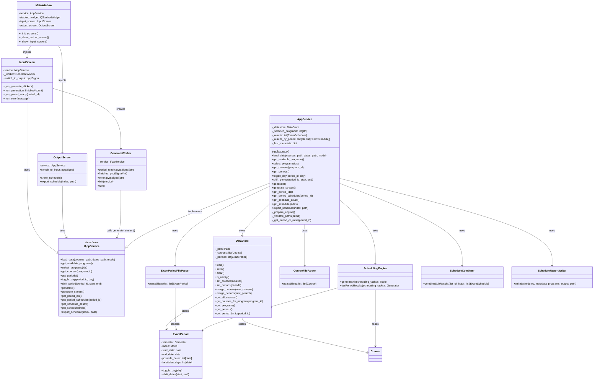

# Presenter Layer Class Diagram

Detailed view of the MVP Presenter layer: the `IAppService` contract, the singleton `AppService`, the `DataStore` model, the `GenerateWorker` background thread, and their relationships to the View screens and external subsystems.

## Overview
- **MainWindow**: Root PyQt5 scaffold; owns a `QStackedWidget` and wires navigation signals between screens
- **InputScreen**: View for file loading, program selection, period editing, and generation trigger
- **OutputScreen**: View for browsing and exporting generated schedules
- **GenerateWorker**: `QThread` subclass that drives `generate_stream()` off the main thread, emitting `period_ready` and `finished` signals
- **IAppService**: Abstract interface — the only contract Views may use; no direct imports of models, parsers, or algorithm classes allowed in the View layer
- **AppService**: Singleton Presenter implementing `IAppService`; owns `DataStore`, orchestrates parsers, engine, combiner, and writer
- **DataStore**: Persists parsed `Course` and `ExamPeriod` objects to disk via pickle so unchanged files are not re-parsed on every startup
