# Presenter Layer Class Diagram

Structure of the MVP Presenter layer: the `IAppService` contract, singleton `AppService`, `DataStore` model, `EngineListener` thread, multi-process wrapper, and disk I/O bridge classes.

```mermaid
classDiagram
    direction TB

    %% ===== View Layer (abbreviated) =====
    class InputScreen {
        -service: IAppService
        +switch_to_output: pyqtSignal
        +_on_generate_clicked()
        +_on_period_ready(period_id)
        +_on_generation_finished(count)
    }

    class OutputScreen {
        -service: IAppService
        -_period_indices: Dict~str,int~
        +POLL_INTERVAL_MS: int = 150
        +switch_to_input: pyqtSignal
        +connect_listener(listener)
    }

    %% ===== Background Thread (UI Process) =====
    class EngineListener {
        -_service: IAppService
        +period_ready: pyqtSignal(str)
        +finished: pyqtSignal(int)
        +error: pyqtSignal(str)
        +__init__(service)
        +run()
    }


    %% ===== Presenter Interface =====
    class IAppService {
        <<interface>>
        +load_data(courses_path, dates_path, mode, programs_path)
        +get_available_programs()
        +select_programs(ids)
        +get_courses(program_id)
        +get_periods()
        +toggle_day(period_id, day)
        +shift_period(period_id, start, end)
        +generate_stream()
        +get_period_ids()
        +get_schedule_count(period_id)
        +get_period_schedule(period_id, index)
        +export_by_period_indices(period_indices, path)
    }

    %% ===== Presenter =====
    class AppService {
        -_datastore: DataStore
        -_selected_programs: list[str]
        -_last_metadata: dict
        -_results_writer: PeriodResultsWriter
        -_results_reader: ResultsReader
        -_engine_process: EngineProcess
        +getInstance()$
        +load_data(courses_path, dates_path, mode, programs_path)
        +get_available_programs()
        +select_programs(ids)
        +get_courses(program_id)
        +get_periods()
        +toggle_day(period_id, day)
        +shift_period(period_id, start, end)
        +generate_stream()
        +get_period_ids()
        +get_schedule_count(period_id)
        +get_period_schedule(period_id, index)
        +export_by_period_indices(period_indices, path)
        -_prepare_engine()
        -_validate_paths(paths)
        -_get_period_or_raise(period_id)
        -_format_schedule_rows(schedule)
        -_default_program_names_path()
        -_load_default_program_names()
    }

    %% ===== Model =====
    class DataStore {
        -_path: Path
        -_courses: list[Course]
        -_periods: list[ExamPeriod]
        -_program_names: dict[str, str]
        +load()
        +save()
        +clear()
        +is_empty()
        +set_courses(courses)
        +set_periods(periods)
        +set_program_names(names)
        +merge_courses(new_courses)
        +merge_periods(new_periods)
        +get_all_courses()
        +get_courses_for_program(program_id)
        +get_programs()
        +get_periods()
        +get_period_by_id(period_id)
    }

    class ExamPeriod {
        -semester: Semester
        -moed: Moed
        -start_date: date
        -end_date: date
        -possible_dates: list[date]
        -forbidden_days: list[date]
        +period_id: str
        +toggle_day(day)
        +shift_dates(start, end)
    }

    %% ===== Disk I/O Bridge =====
    class PeriodResultsWriter {
        -_root: Path
        +BATCH_SIZE: int
        +write_batch(period_id, schedules)
        +update_manifest(period_id, count)
    }

    class ResultsReader {
        -_root: Path
        +get_count(period_id) int
        +get_schedule_at(period_id, index) ExamSchedule
        +get_period_ids() list[str]
    }

    %% ===== Multi-process Wrapper =====
    class EngineProcess {
        -_task_queue: mp.Queue
        -_notify_queue: mp.Queue
        -_process: mp.Process~daemon=True~
        +start(engine, tasks)
        +get_notification() dict
        +stop()
    }


    %% ===== External Subsystems (abbreviated) =====
    class ExamPeriodFileParser {
        +parse(filepath) list[ExamPeriod]
    }

    class CourseFileParser {
        +parse(filepath) list[Course]
    }

    class ProgramsParser {
        +parse(filepath)$ dict[str, str]
    }

    class SchedulingEngine {
        +generateAll(scheduling_tasks) Tuple
        +iterPeriodResults(scheduling_tasks) Generator
        +solve_to_disk(period, courses_dict, writer) int
    }

    class ScheduleCombiner {
        +combineSubResults(list_of_lists) list[ExamSchedule]
    }

    class ScheduleReportWriter {
        +write(schedules, metadata, programs, output_path)
    }

    %% ===== Relationships =====
    InputScreen --> EngineListener : creates
    InputScreen --> IAppService : uses
    OutputScreen --> IAppService : uses
    OutputScreen --> EngineListener : connect_listener()
    EngineListener --> IAppService : calls generate_stream()
    AppService --|> IAppService : implements
    AppService --> DataStore : owns
    AppService --> ResultsReader : owns
    AppService --> EngineProcess : optionally owns
    AppService --> ExamPeriodFileParser : uses
    AppService --> CourseFileParser : uses
    AppService --> ProgramsParser : uses
    AppService --> SchedulingEngine : uses
    AppService --> ScheduleCombiner : uses
    AppService --> ScheduleReportWriter : uses
    EngineProcess --> PeriodResultsWriter : subprocess uses
    ResultsReader --> ExamSchedule : reads from disk
    DataStore --> ExamPeriod : stores
    DataStore --> Course : stores
    ExamPeriodFileParser --> ExamPeriod : creates
```

## Overview
- **IAppService**: The only interface Views may call. Enforces the MVP boundary — no View file may import from algorithm, models, or parsers directly.
- **AppService**: Singleton Presenter. Supports three generation modes: multiprocessing (EP-83), file-based single-process (EP-82), and legacy in-memory.
- **DataStore**: Persists `Course`, `ExamPeriod`, and program-name mappings to `data/datastore.pkl` via pickle.
- **EngineListener**: `QThread` subclass (formerly `GenerateWorker`). Iterates `generate_stream()` on a background thread; emits `period_ready` and `finished` signals back to the main thread.
- **EngineProcess**: Manages a daemon `multiprocessing.Process`. Sends work via `task_queue` and receives `period_done` notifications via `notify_queue`. No heavy objects cross the process boundary — only period IDs.
- **PeriodResultsWriter**: Writes solved schedules to `data/results/<period_id>/batch_XXXX.pkl` files in batches of 50. Updates `manifest.json` after each batch.
- **ResultsReader**: Reads individual schedules from batch files by index without loading entire periods into RAM.
- **ProgramsParser**: Static parser that reads `data/programsName.txt` and returns a `{program_id: display_name}` map.
