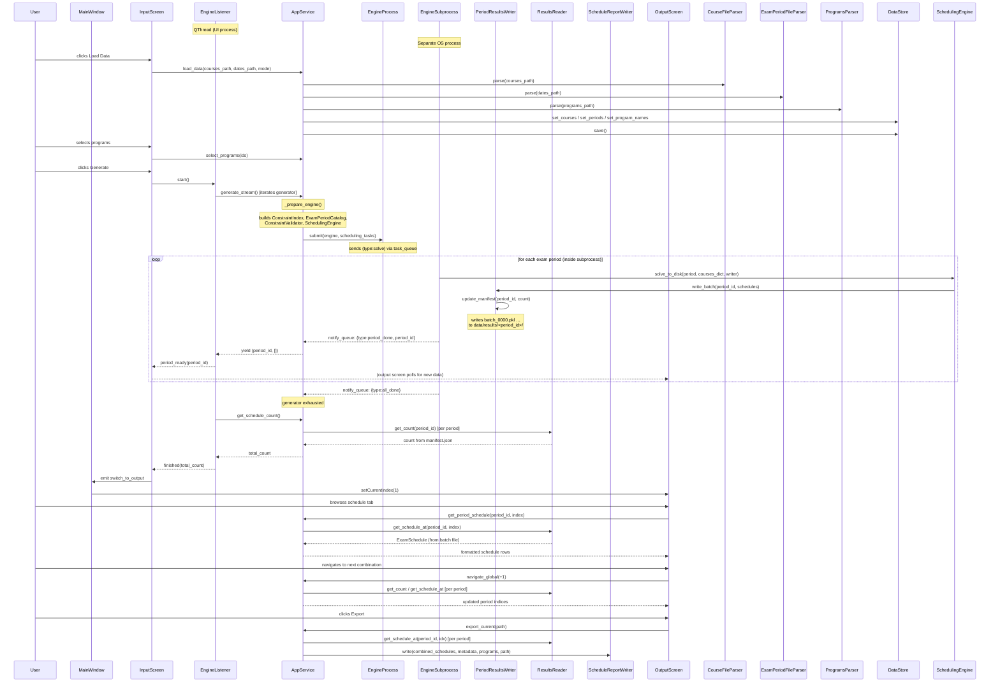

# Presenter Layer Sequence Diagram

The primary use-case flow through the Presenter layer in **multiprocessing mode (EP-83)**: loading data, selecting programs, streaming generation across two processes, per-period navigation, and export.

## Flow Summary
1. **Load Data** — `InputScreen` calls `AppService.load_data()`. Parsers run, results saved to `DataStore`.
2. **Select Programs** — `InputScreen` calls `AppService.select_programs(ids)`.
3. **Generate (multiprocessing)** — `InputScreen` creates `EngineListener` and starts it. The listener iterates `AppService.generate_stream()`, which submits tasks to the `EngineProcess`. The daemon subprocess calls `SchedulingEngine.solve_to_disk()` for each period, writing batched pickle files. For each finished period it sends a `period_done` notification back through `notify_queue`. The listener translates each yield into a `period_ready` signal.
4. **Navigate** — `InputScreen` emits `switch_to_output`; `MainWindow` switches the stacked widget.
5. **Browse** — `OutputScreen` calls `get_period_schedule(period_id, index)` and `navigate_global(±1)` to page through results. All reads go through `ResultsReader` directly from disk — no results are held in RAM.
6. **Export** — `OutputScreen` calls `export_current(path)`. `AppService` reads one schedule per period from disk, merges them with `ScheduleCombiner`, and writes via `ScheduleReportWriter`.

## Generation Modes
| Mode | Trigger | Where schedules live |
|------|---------|---------------------|
| Multiprocessing (EP-83) | `_engine_process` is set | Engine subprocess → disk (batch files) |
| File-based single-process (EP-82) | `_results_writer` is set | AppService → disk (batch files) |
| Legacy in-memory | neither is set | RAM (`_results_by_period` + `_results`) |
