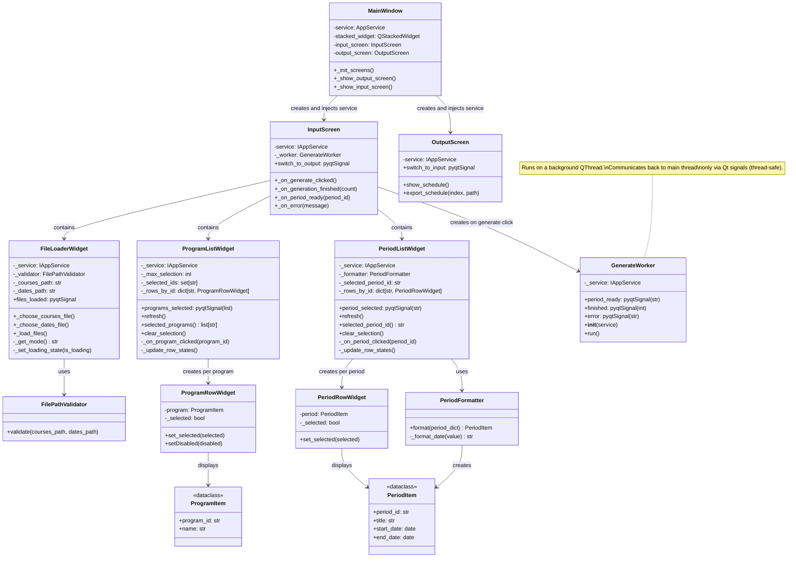

# View Layer Class Diagram

Detailed structure of the PyQt5 View layer: screens, reusable widgets, view-model dataclasses, and the background worker thread. Everything above the dashed thread boundary runs on the Qt main thread; `GenerateWorker.run()` executes on a dedicated QThread.

## Overview
- **MainWindow**: Root QMainWindow; owns a `QStackedWidget` with `InputScreen` at index 0 and `OutputScreen` at index 1. Wires `switch_to_output` / `switch_to_input` signals to navigate between them.
- **InputScreen**: Top-level input screen. Composes `FileLoaderWidget`, `ProgramListWidget`, and `PeriodListWidget`. Creates a `GenerateWorker` when the user clicks Generate.
- **OutputScreen**: Displays and paginates generated schedules; supports export.
- **FileLoaderWidget**: Lets the user pick two files and a load mode (replace/append). Delegates validation to `FilePathValidator` and loading to `IAppService.load_data()`. Emits `files_loaded` on success.
- **ProgramListWidget**: Scrollable, selectable list of academic programs (max 5). Calls `IAppService.select_programs()` on every toggle. Emits `programs_selected`.
- **PeriodListWidget**: Scrollable list of exam periods. Emits `period_selected` when a row is clicked. Uses `PeriodFormatter` to convert raw service dicts into display-friendly `PeriodItem` objects.
- **GenerateWorker**: `QThread` subclass. Iterates `IAppService.generate_stream()` on a **background thread**. Emits `period_ready(period_id)` per period and `finished(count)` when done. All communication back to the UI is through Qt signals (thread-safe crossing of the thread boundary).

## Threading model
| Thread | Runs |
|--------|------|
| Main (Qt event loop) | `MainWindow`, `InputScreen`, `OutputScreen`, all widgets |
| Worker (QThread) | `GenerateWorker.run()` only |

Signals (`period_ready`, `finished`, `error`) are automatically queued across the thread boundary by Qt — no manual locking is needed.
