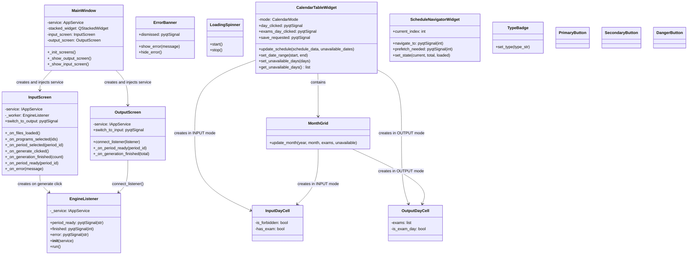

# View Layer Class Diagram (Overview)

High-level overview of the PyQt5 View layer: the two screens, the background worker thread, and shared reusable components. For widget-level detail see `InputScreenDiagram` and `OutputScreenDiagram`.

## Overview
- **MainWindow**: Root `QMainWindow`; owns a `QStackedWidget` with `InputScreen` at index 0 and `OutputScreen` at index 1.
- **InputScreen**: The full input flow screen — see `InputScreenDiagram` for all contained widgets.
- **OutputScreen**: The schedule display screen — see `OutputScreenDiagram` for all contained components.
- **EngineListener**: `QThread` subclass (re-exported as `GenerateWorker` for backward compatibility). Runs `IAppService.generate_stream()` on a background thread; emits `period_ready`, `finished`, `error` signals back to the Qt main thread.
- **CalendarTableWidget**: Dual-mode (INPUT/OUTPUT) calendar shared between `PeriodEditorWidget` and `OutputScreen`. In INPUT mode shows forbidden-day toggles; in OUTPUT mode shows exam assignments.
- **MonthGrid / InputDayCell / OutputDayCell**: Low-level calendar rendering components inside `CalendarTableWidget`.
- **ErrorBanner, LoadingSpinner, TypeBadge, PrimaryButton, SecondaryButton, DangerButton**: Shared UI components used across multiple screens and widgets.

## Threading Model
| Thread | Runs |
|--------|------|
| Qt main thread (event loop) | All widgets, screens, `MainWindow` |
| Background QThread | `EngineListener.run()` only |

Signals (`period_ready`, `finished`, `error`) are automatically queued across the thread boundary by Qt — no manual locking needed.
